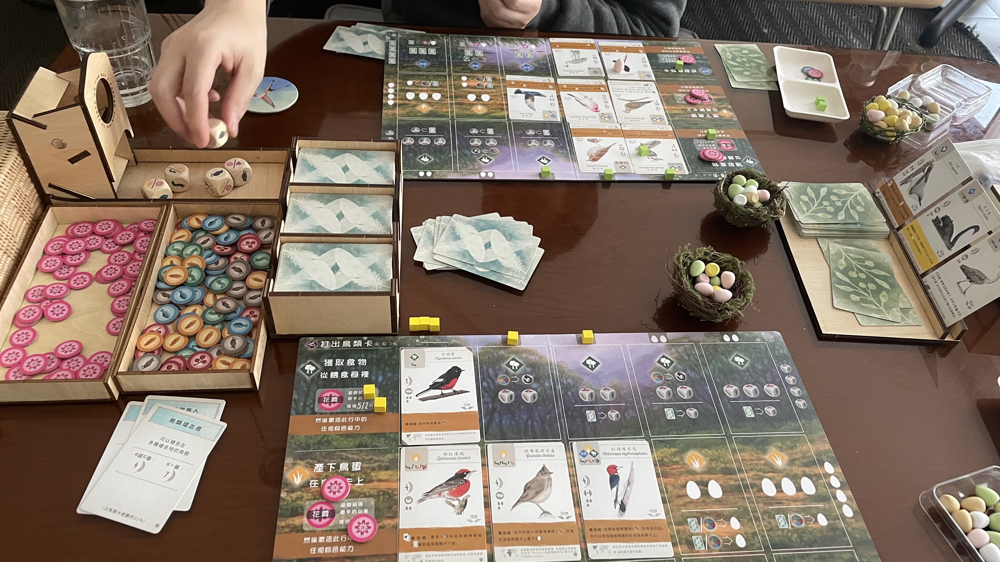
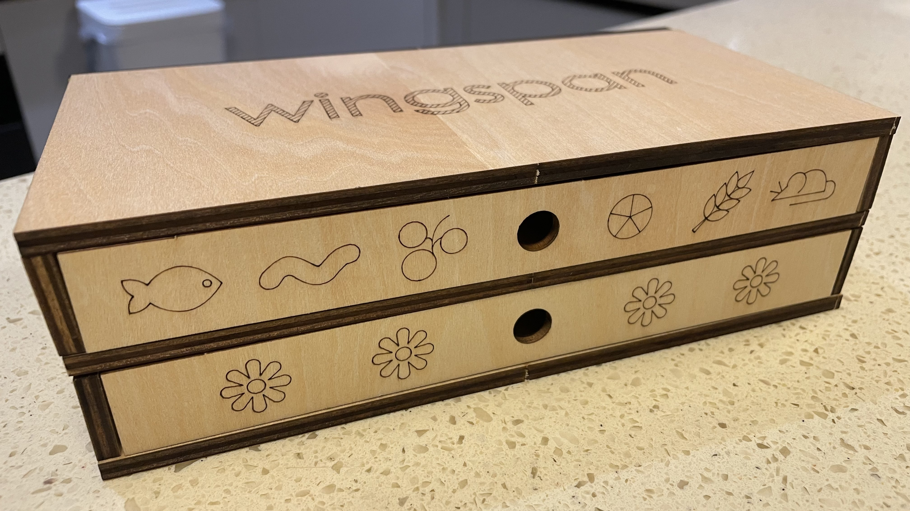
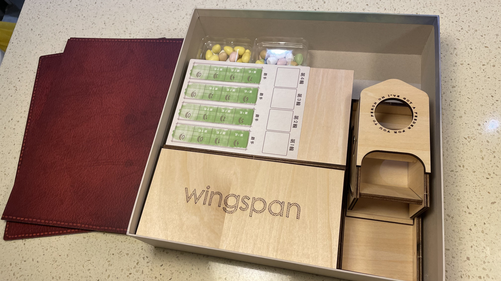
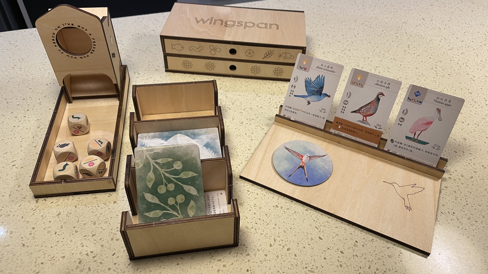
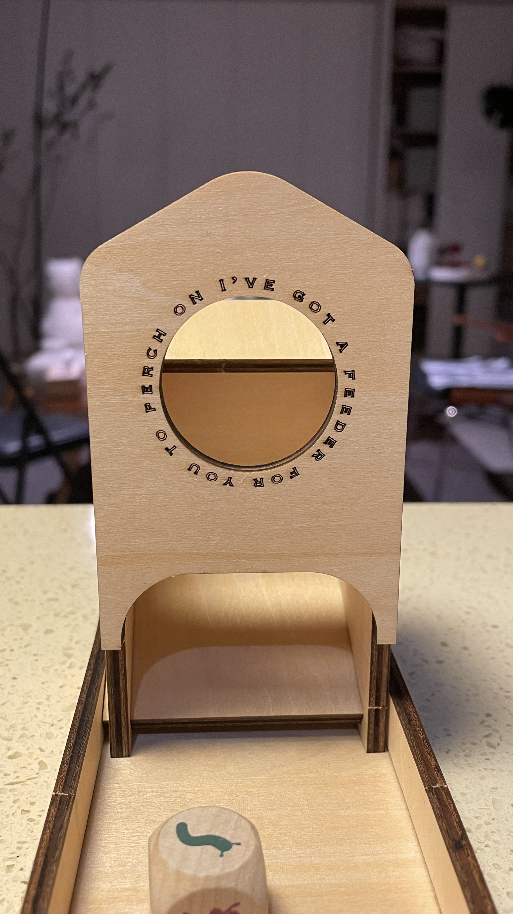

# WingspanOrganizer
Storage solution for Wingspan and its European &amp; Oceania expansions, fitting into the base game box. Made with laser-cut wood panels. 

# Notification
1.Due to the ultimate optimization of space, this system includes only three player mats. 
2.The dice tower can be made separately, as it has been split into an independent file. 
3.Use 5mm and 3mm wood panels as specified, check the file names for reference. 
4.Cut along the white lines and engrave the red lines. 
5.Use specialized glue for assembly. 
6.The pre-cut holes are for magnetic extensions. You can choose suitable magnets to assemble, but no additional accessories are provided. 

# Whats include
1.Cards container 
2.Dice tower 
3.Dice storage 
4.Foods Drawer 
5.Card display stand *also a cover for cards container 

# Whats exclude
egg nest；action cubes container；goal tiles container；magnets； 
*just find them around you ：）
 

